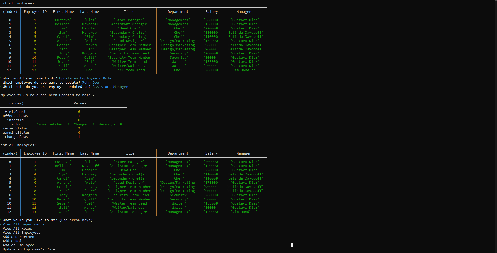

# Challenge 12, Employee Data

## Description

Employee data is key for a company to thrive, so with this application managers or companies can easily view their employee list and what department they are in, while also being able to see what their actual job is. This application also allows for whoever is using it to update or add a new employee, making it much easier to keep track of everyone.

## Table of Contents

- [Description](#description)
- [Installation](#installation)
- [Usage](#usage)
- [License](#license)
- [Contributing](#contributing)
- [Tests](#tests)

## Installation

Sadly, their is no way to install this product yet as it is ran off of my personal command line.

## Usage

This app can be used by companies or managers to keep track of their employees data.

## License

MIT

## Contributing

Gustavo Diaz

## Tests

See Link: https://drive.google.com/file/d/1s39CY0MXnTOu6mAZYj7e_0zBVtFYMhSa/view 

For more information, visit my GitHub profile: [diazgus411](https://github.com/diazgus411)

To contact me, send an email to: "diazgus411@gmail.com"

